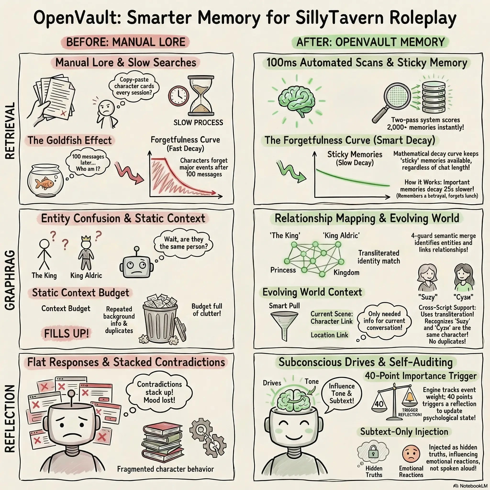

# OpenVault: Long-Term Memory for SillyTavern

Long roleplays fall apart because context windows fill up. Characters forget plot points. Manual lorebooks become a chore. And vector databases make characters weirdly omniscient-they somehow know secrets from conversations they were never part of

OpenVault fixes this. It runs in the background while you chat, tracking what actually happened, who was there, and how relationships evolve. No external databases. No Docker. No Python servers. Everything lives inside SillyTaverns native chat storage. Can be used with free models

---

  

  
  
  

---

## The POV Problem (and the Fix)

Heres what breaks with most memory systems: you have a secret conversation with Character A. Later you're alone with Character B. You ask "what should we do about that secret?" and Character B responds like they were there

Thats not how memory works

OpenVault tracks witnesses. Every extracted event records who was present. Characters only recall what they actually experienced, were told directly, or overheard. No more accidental omniscience

## What It Actually Does

**Event Extraction.** As you chat, OpenVault identifies what happened-actions, emotional shifts, revelations. Each event gets an importance rating (1-5 stars) and a witness list

**Knowledge Graph.** People, places, factions, objects, and concepts get tracked as nodes. Relationships between them are edges that update over time. When two characters go from enemies to allies, the graph knows

**Reflections.** After enough significant events pile up for a character, OpenVault pauses to reflect. It synthesizes raw memories into psychological insights-shifting motivations, subconscious drives, evolving relationship dynamics. These are *internal* truths, not things the character says out loud

**GraphRAG Communities.** Every 50 messages, it analyzes the relationship web to detect social circles and factions. This produces a running "world state" summary so macro-level plots don't get lost

**Smart Retrieval.** Before the AI generates a response, OpenVault scores all candidate memories using a blend of:
- Exponential forgetfulness (old trivial stuff fades, critical memories stick)
- BM25 keyword matching
- Vector similarity against recent context

Memories get injected into the prompt in chronological buckets: *The Story So Far*, *Leading Up To This Moment*, *Current Scene*, and hidden *Subconscious Drives* that influence behavior without being spoken

## Setup

**Requirements:**
- SillyTavern 1.13.0+
- An extraction-capable LLM (mid-tier models work fine)

**Embeddings:** By default, OpenVault downloads a lightweight multilingual model (`multilingual-e5-small`) that runs in your browser via WebGPU/WASM. Or point it at your local Ollama instance

Thats it. No ChromaDB. No Docker. No cloud vector service

## How the Interface Works

OpenVault adds a panel to SillyTaverns Extensions menu. The layout is intentionally progressive-common stuff up front, tuning buried in collapsible sections

**Dashboard.** Status, health, and a live Payload Calculator showing exactly how many tokens your extraction model needs

**Memories.** Searchable memory bank. Filter events vs reflections. Edit importance or summaries manually. View character emotional states

**World.** Read-only viewer for the knowledge graph. Browse communities, factions, and tracked entities

**Advanced.** Tuning knobs: alpha-blend weights, decay rates, similarity thresholds. Most users should leave these alone

**Perf.** Real-time metrics so you know if background processing is bottlenecking your browser

## Injection Positions

You control where memories appear in the prompt:

| Position | Where it goes |
|----------|---------------|
| ↑Char | Before character card |
| ↓Char | After character card (default, recommended) |
| ↑AN | Top of authors note |
| ↓AN | Bottom of authors note |
| In-chat | At specific message depth |
| Custom | Manual placement via macros |

**Manual macros** (when set to Custom):
- `{{openvault_memory}}` - Memory context
- `{{openvault_world}}` - World/faction context

The main panel shows current positions as badges like `[↓Char | ↑AN]`. Click a macro badge to copy it

## Multilingual Support

OpenVault handles non-English roleplay without mangling JSON. It detects script (Latin, Cyrillic, etc.), uses appropriate stemming, and deduplicates characters across scripts

## Privacy

Everything stays on your machine. The in-browser embedding model means no text goes to third-party services. The only network calls are to your configured LLM endpoint (local or API-your choice)

## Research Credits

- **GraphRAG** - Community detection and hierarchical summarization. Park et al., *"From Local to Global: A Graph RAG Approach to Query-Focused Summarization"* ([arXiv:2404.16130](https://arxiv.org/abs/2404.16130))

- **Generative Agents** - Importance-weighted memory, reflection triggers, observation loops. Park et al., *"Generative Agents: Interactive Simulacra of Human Behavior"* ([arXiv:2304.03442](https://arxiv.org/abs/2304.03442))

## Version History

- **22.00** - Bugfixes (about 20 of them)
- **21.00** - Provides a manual mechanism to merge two entities
- **20.00** - Entity editing, deletion, and alias management with tab restructure from "World" to "Entities" + "Communities"
- **19.00** - Exclude the last N complete turns from extraction batches so hallucinated/swiped AI responses dont enter the memory
- **18.50** - Rewrite examples with sonnet
- **17.00** - Add commitment/preference to memory, add real time tracking. New type of memories - transient with faster decay
- **16.00** - Improved LLM answer parsing
- **15.50** - Added data schema versioning for easier migrations
- **15.00** - Major refactoring, bug fixes
- **14.00** - Emergency Cut button (prune chat history while keeping key events)
- **13.50** - Compatibility with other chat-altering extensions
- **13.00** - Support for all ST vectorization sources
- **12.50** - Customizable injection positions
- **12.00** - UI revamp (protecting users from over-tuning)
- **11.50** - Fixed memory balance distribution
- **11.00** - Test refactoring, prep for additional languages
- **10.50** - Fixed hairball cluster bug
- **10.00** - Parallel request support
- **9.50** - Group play PoV fixes
- **9.00** - Stable single-character RP release

## Free models

Check my other project https://github.com/vadash/litellm_loader. Its a bit Do It Yourself, but should provide nice start. You can setup complex fallbacks. For example, try (Kimi K2 and Kimi K2 0905 at Nvidia NIM), if both down then use long cat chat

## License

GNU AGPL v3.0
